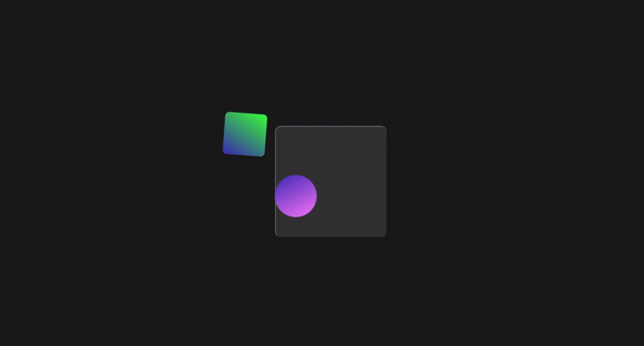

## Project Overview

The animation project displays a pair of shapes moving in a continuous loop with scaling and rotating effects. The background is set to a dark theme to highlight the animation. The text elements are styled for a clean, modern look.

## Animation Details

The animation involves three overlapping shapes that move, scale, and rotate in a synchronized pattern:

## Technologies Used

- **React.js:** 
- **HTML5:**
- **CSS3:**
- **JavaScript:** 

### Background Shape (Span 1):

- Appears as a blurred rectangular shape.
- Stays stationary and adds depth with a semi-transparent, blurred effect.

### Foreground Shapes (Span 2 and Span 3):

- **Span 2**: A circle with a linear gradient transitioning from magenta to blue.
- **Span 3**: A shape with a linear gradient transitioning from green to blue.
- Both shapes move in opposite directions, scale down to 40% of their size, and rotate 360 degrees.
- Their movement creates a dynamic, intertwining effect.

### Keyframes Explanation

#### @keyframes box:

- Moves Span 2 from the bottom-left to the top-right, rotating and scaling it.
- Changes its z-index at the midpoint to bring it above Span 3.

#### @keyframes box2:

- Moves Span 3 from the bottom-right to the top-left, rotating and scaling it.
- Changes its z-index at the midpoint to bring it above Span 2.

This coordinated movement and z-index manipulation create a mesmerizing visual interplay between the shapes.